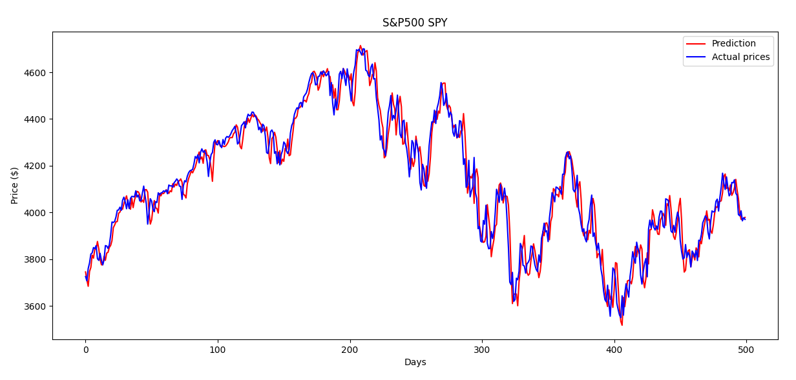

# Linear Regression for stock prices prediction

## Strategy

We want to be able to predict the price of a stock action, S&P500 SPY in this example (taken from [Kaggle](https://www.kaggle.com/datasets/gkitchen/s-and-p-500-spy)).

We'll use a linear regression model implementing gradient descent technique.

Stock prices for a given day can be influenced by the previous days' exchanged volumes, and the opening, closing, highest, and lowest prices.

We will train and test the model on a time period called $T$.

Let's call current day $t$, and $n$ the number of days preceding $t$ used to predict the price at $t+1$ .

Input features $X_t^{(i)}$ will be the data for days in range $[t-n\cdots t]$ and the associated target $Y_{t+1}^{(i)}$ will be the closing price at time $t+1$.

## Current results

### Configuration used

- Total time $T = 2500$
- Period $n = 4$
- Number of iterations $k = 10.000$
- Convergence threshold of $1e^{-8}$
- Learning rate $\alpha = 0.1$
- $X$ features :
    - *Open*
    - *High*
    - *Low*
    - *Close*
    - *Volume*
- *Close* feature used as $Y_{t+1}$

### Result

An average accuracy of 98.9% was reached during the testing step, with a convergence met after 5200 iterations.

The model as been saved and provided as an example, see `model/example.model.json` in this repository.

## Workflow

### Data processing

#### Preprocessing

- Drop unused columns from dataset
- Interpolate missing data
- Slice the dataset to match the whole studied period's length
- Scale the data to range between $[0 \cdots 1]$

#### Building training and test datasets

- Group first 80% data by packs of length $n$ for every $X_t^{(i)}$ and its associated target $Y_{t+1}^{(i)}$ for training
- Group last 20% data by packs of length $n$ for every $X_t^{(i)}$ and its associated target $Y_{t+1}^{(i)}$ for testing

### Training

We will use **gradient descent** and **mean squared error** to train the model.

#### Model

The linear regression model will implement the following function :

$$f_{\vec{w}, b}(\vec{x}) = \vec{w}\cdot \vec{x} + b$$

#### Cost function
The model cost function using mean squared error with $m$ being the dataset's length:

$$
J(\vec{w}, b) = \frac{1}{2m} \sum_{i = 1}^{m} (f_{\vec{w}, b}(\vec{x}^{(i)}) - y^{(i)})²
$$

#### Cost derivatives

To compute the gradient when performing the descent, we will use partial derivatives of the cost function :

- Partial derivative of $J$ with respect to $\vec{w}$, computed for every feature $x^{(i)}_n$ of $x^{(i)}$:

    $$\frac{\delta}{\delta \vec{w}}J(\vec{w}, b) = \frac{1}{m} \sum_{i=1}^{m} (f_{\vec{w}, b}(\vec{x}^{(i)})-y^{(i)})x_n^{(i)}$$

- Partial derivative of $J$ with respect to $b$:

    $$\frac{\delta}{\delta b}J(\vec{w}, b) = \frac{1}{m} \sum_{i=1}^{m} (f_{\vec{w}, b}(\vec{x}^{(i)})-y^{(i)})$$

#### Descent

We will repeat until convergence is met or maximum number of iteration is reached, with $\alpha$ being the model learning rate :

$$\vec{w} = \vec{w} - \alpha\frac{\delta}{\delta \vec{w}}J(\vec{w}, b)$$

$$b = b - \alpha\frac{\delta}{\delta b}J(\vec{w}, b)$$

### Testing

#### Data

The model will be tested with the 20% most recent data saved from the dataset.

#### Reading the result
**Accuracy** must be interpreted as the mean difference between **prediction** and **actual target value**, expressed in percentage.

For example, a model with 97% accuracy must be understood as a model that predicts the target price for each input with a margin error of 3%, and not as a model that predicts the exact price 97% of the time.

### Saving

Right after a training and testing session, the result of the model's accuracy, weights and bias will be stored in a json file within the `models` folder located at this repository's root.

Note that the config in which the model was trained and tested will also be saved in the same JSON object.

Please refer to the `README.md` stored in the `models` folder for further documentation about the results and model saving.

### Displaying

For better result readability, when the training and testing of the model are done, the main script will display a graph with both predicted and actual closing prices versus time.

The cost versus time evolution will also be displayed to render the training step.

## Running the project

### Setup

#### Requirements
Install the required Python's libraries (it's recommended to setup a virtual environnement so that your own libraries do not get messed up) :

`python3 -m pip install -r requirements.txt`

You can then tweak the values in the `config.json` file that the Price Forecaster will use to train and test its model.

#### Configuration file

There you can find the keys used in the configuration file, and the type and meaning of its values, with documentation formatted as *`key`: (type) Meaning*.

- `csv_path`: (string) Path to the csv dataset
- `target_label`: (string) Label of the target column
- `exclude_labels`: ([string]) Labels of the excluded columns
- `total_time`: (int) Total studied period
- `period`: (int) Number of rows to form one input
- `iterations`: (int) Max number of iterations for gradient descent
- `convergence_threshold`: (float) threshold to determine if convergence is met
- `alpha`: (float) Learning rate used to scale the descent derivatives
- `scaling_method`: (string) Method used for scaling data

### Command-line execution

The project entry-point is the `main.py` file located at the root of this repository.

The script can take an optionnal argument, being the path to a pre-trained model.

**Note:** If a pre-trained model is loaded, its structure must match the one documented in the `models/README.md` file, plus have the same `config` value as the one of the current `config.json` (else an exception will be thrown).

#### Run the script

Without argument : `python3 main.py`

With pre-trained model argument: `python3 main.py $path/to/pretrained/model.json$`

## Disclaimer

### No investment advice provided

This project is made for **entertainment and educational purposes only** and do not constitute investment advice.

As the author of the provided base code, I will not accept liability for any loss or damage, including without limitation any loss of profit, which may arise directly or indirectly from use of or reliance on the algorithmically generated information.
